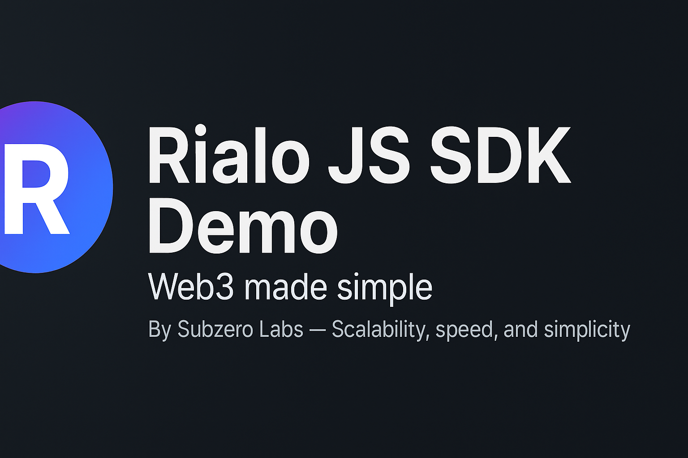

<div align="center">
  

  # 🚀 Rialo JS SDK Demo
  **JavaScript example using the Rialo blockchain**  
  _By Subzero Labs — Scalability, speed, and simplicity_

  [](LICENSE)
  [](https://github.com/0xBiry/rialo-js-sdk-demo/stargazers)
  [](https://twitter.com/RialoHQ)
</div>

---

## About
This project demonstrates how to interact with **Rialo**, the next-generation **Layer 1 blockchain** built for developers.  
Rialo combines **RISC-V smart contracts**, **Solana VM compatibility**, and **native web connectivity**, delivering:  
✅ Ultra-low latency  
✅ Event-driven execution  
✅ Built-in privacy  

---

## Features
- 🔗 Connect to the **Rialo Devnet**
- ⚡ Clean **JavaScript/Node.js** example
- 🧩 Ready to integrate into your dApps
- 🔒 Built for real-world APIs without oracles

---

## 📥 Installation
```bash
git clone https://github.com/0xBiry/rialo-js-sdk-demo.git
cd rialo-js-sdk-demo
npm install
```

---

Usage
```bash
node index.js
```

---

📚 Resources

🌐 [`Official Rialo Website`](https://www.rialo.io/)

🐦 [`Twitter/X`](https://x.com/RialoHQ?t=M_-_fcQCWSgvuz6ckCIboA&s=09)


---

🤝 Contributing

Contributions are welcome!

1. Fork the repository

2. Create your branch (git checkout -b feature/my-feature)

3. Commit your changes (git commit -m 'Add new feature')

4. Push to your branch (git push origin feature/my-feature)

5. Open a Pull Request

---

## **index.js**
```javascript
console.log("🚀 Welcome to Rialo!");
console.log("This is where you can connect your dApp to the Rialo blockchain.");
console.log("⚡ Example: Fetching real-time network data...");

// Mock example (replace with actual Rialo SDK calls when available)
async function getBlockchainInfo() {
    return {
        network: "Rialo Devnet",
        status: "✅ Online",
        latency: "50ms"
    };
}

getBlockchainInfo().then(info => {
    console.log("ℹ️ Network Info:", info);
});
